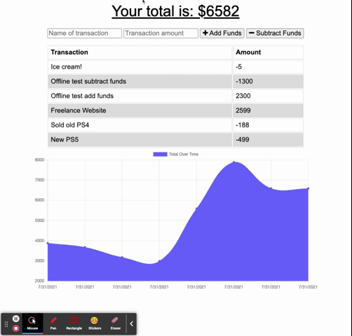
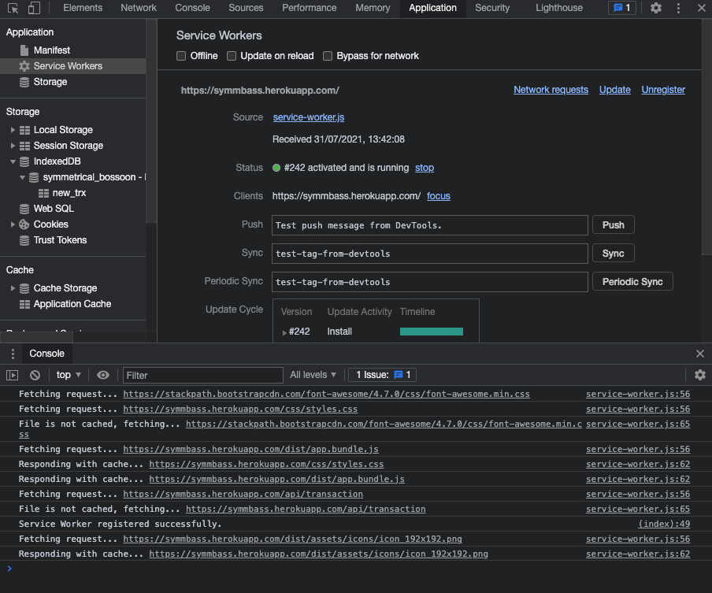
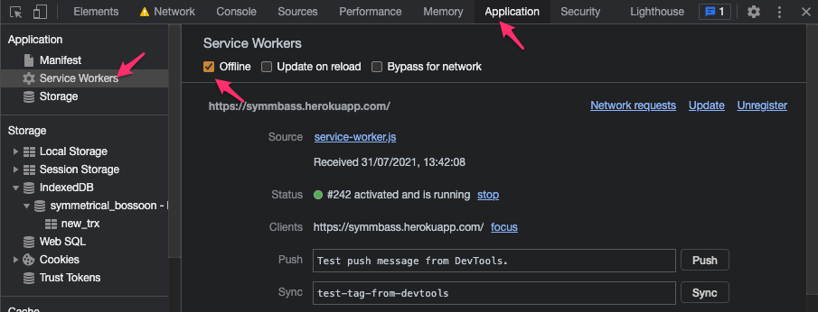
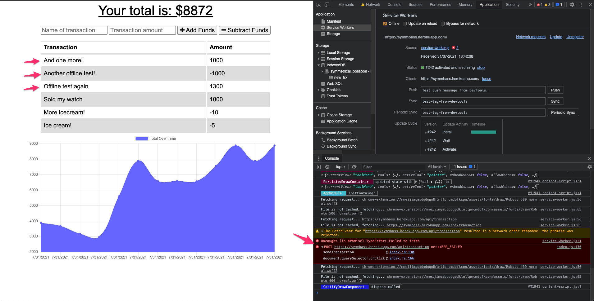
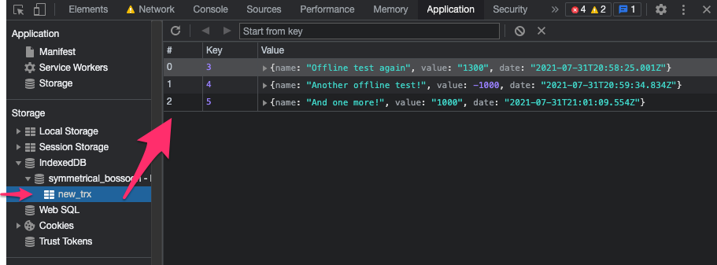
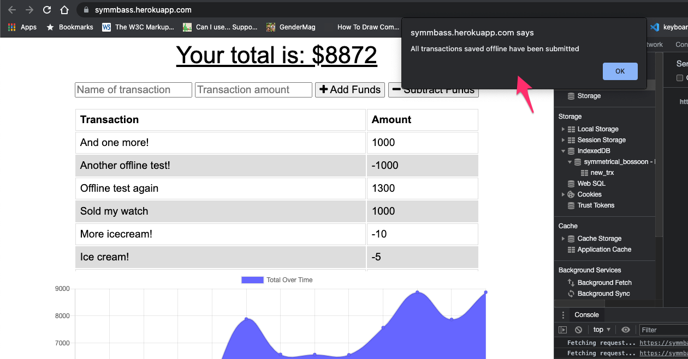

# Budget App : SymmBass
[](https://www.gnu.org/licenses/gpl-3.0)

SymmBass is a Node.js app that utilizes IndexedDB, ServiceWorker, and SessionStorage to maintain offline functionality. The app is designed to track a personal budget with or without internet connection.

**Table of Contents**
- [Budget App : SymmBass](#budget-app--symmbass)
  - [Installation](#installation)
  - [Usage](#usage)
    - [Online usage:](#online-usage)
    - [Offline usage:](#offline-usage)
  - [Code](#code)
    - [Service Worker](#service-worker)
    - [IndexedDB](#indexeddb)
  - [Session Storage](#session-storage)
  - [Questions](#questions)


## Installation
If you'd like to download and install the app, review the packag.json file and run `npm install`. You'll also need MongoDB installed locally (as well as npm-cli to run the install command). You can see the app live here: https://symmbass.herokuapp.com/ 

```
"dependencies": {
    "file-loader": "^6.2.0",
    "image-webpack-loader": "^7.0.1",
    "webpack": "^5.47.1",
    "webpack-bundle-analyzer": "^4.4.2",
    "webpack-cli": "^4.7.2",
    "webpack-dev-server": "^3.11.2",
    "webpack-pwa-manifest": "^4.3.0",
    "@heroku-cli/plugin-buildpacks": "^7.54.0",
    "@heroku/buildpack-registry": "^1.0.1",
    "@popperjs/core": "^2.9.2",
    "@types/compression": "^1.7.1",
    "async-file": "^2.0.2",
    "bootstrap": "^4.3.1",
    "cli-ux": "^4.9.3",
    "express": "^4.17.1",
    "got": "^8.3.2",
    "heroku": "^7.56.1",
    "jquery": "^3.6.0",
    "mongoose": "^5.13.3",
    "morgan": "^1.10.0",
    "nodemon": "^2.0.12",
    "phoenix": "^1.5.9",
    "yargs": "^13.3.2"
}
```

Optional nodemon instead of node: `"start": "node server.js"`

Prior to run the app, you'll need to build it by running `npm run build` this will package the app assets and scripts under `/public/dist`.

## Usage
SymmBass works online and offline, follow these usage instructions:

### Online usage:
Go to : https://symmbass.herokuapp.com/ - Enter a transaction name and amount, click on `+Add funds` or `-Subtract funds` depending on the type of transaction (debit vs credit). See the visual below:



While online, the app will perform a couple tasks to prep for an offline situation (although the cached assets are also used on successive online visits, imporving performance):

1. Register service worker cache
2. Store transaction list in local storage



### Offline usage:
Open Chrove Dev Tools and go to Application / Service Workers. Click on "Offline". This will allow you to emulate no Internet connection. Here's where the fun begins!



Enter another transaction name and amount, hit `+Add funds` or `-Subtract funds`, the amount will be added to the transaction list, just as if it was online:



However, notice on the console that our `FETCH` encountered an error - this is perfectly normal, because the app is offline, however, the data was saved locally on `IndexedDB / symmetrical_bossoon / new_trx`



Additionally, you can refresh the app, and it will still display the previously stored transactions, along with the new ones. This is because I'm storing the previously saved transactions in session storage, and adding the `new_trx` data on top of it when repainting the screen.

This works because all assets and scripts are cached via service worker. In other words, the app has everything it needs to build the table and chart. Data will continue to exist as long as IndexedDB and session storage are not manually wiped by the user.

Once the app goes back online (Uncheck the `Offline` box on Service Worker), all unsaved transactions will be transmitted to the app, resulting in a seamless user experience - The user wouldn't even know this, but I've added an alert to indicate when offline Trx are uploaded:



## Code
Here's a high-level explanation of the key components for service worker, indexedDB and session storage:

### Service Worker
1. Cached files and Cache config
```
const FILES_TO_CACHE = [
    "./",
    "./index.html",
    "./css/styles.css",
    "./dist/assets/icons/icon_72x72.png",
    "./dist/assets/icons/icon_96x96.png",
    "./dist/assets/icons/icon_128x128.png",
    "./dist/assets/icons/icon_144x144.png",
    "./dist/assets/icons/icon_152x152.png",
    "./dist/assets/icons/icon_192x192.png",
    "./dist/assets/icons/icon_384x384.png",
    "./dist/assets/icons/icon_512x512.png",
    "./dist/app.bundle.js",
];

const APP_PREFIX = 'SymmBass-';     
const VERSION = 'version_01';
const CACHE_NAME = APP_PREFIX + VERSION;

[...]
```

2. Installing Cache
This code installs the cache and adds files to cache when first online.
```
self.addEventListener('install', function (event) {

    event.waitUntil(
        caches.open(CACHE_NAME)
            .then(function(cache) {
                console.log('Installing cache... ' + CACHE_NAME);
                return cache.addAll(FILES_TO_CACHE);
            })
    )

});
```

3. Activating Cache
Post cache installation, it is activated by thte following code:
```
self.addEventListener('activate', function(event) {
    event.waitUntil(
        caches.keys()
            .then(function(keyList){
                let cacheKeepList = keyList.filter(function(key){
                    return key.indexOf(APP_PREFIX);
                });

                cacheKeepList.push(CACHE_NAME);

                return Promise.all(
                    keyList.map(function(key, i) {
                        if (cacheKeepList.indexOf(key) === -1) {
                            console.log('Deleting cache... ' + keyList[i]);
                            return caches.delete(keyList[i]);
                        }
                    })
                )
            })
        );

});
```

4. Fetching from Cache
When assets are cached, any request to pull these assets will fetch from cache instead of pulling from the actual server, saving load time.

```
self.addEventListener('fetch', function(event){
    console.log('Fetching request... ' + event.request.url);
    
    event.respondWith(
        caches.match(event.request)
            .then(function(request) {
                if (request) {
                    console.log('Responding with cache... ' + event.request.url);
                    return request;
                } else {
                    console.log('File is not cached, fetching... ' + event.request.url);
                    return fetch(event.request);
                }

                // optional to the if/else above, use this:
                // return request || fetch(event.request);
            })
        )
});
```

### IndexedDB
This component is used to save new transactions when app is offline. The file `idb.js` contains all the functions needed, and they work as follows:

1. When a user tries to save a transaction, the following function is called from `index.js` (actually `app.bundle.js` because on the final deployment I've web-packaged all assets).

The FETCH operation will fail when the app is offline, landing on the `.catch` portion of the operation. This means an error fetching occurred, and we need to store the data locally by calling `saveTrx`.

```
function sendTransaction(isAdding) {
  
  [...]

  // add to beginning of current array of data
  transactions.unshift(transaction);

  // re-run logic to populate ui with new record
  populateChart();
  populateTable();
  populateTotal();
  
  // also send to server
  fetch("/api/transaction", {
    method: "POST",
    body: JSON.stringify(transaction),
    headers: {
      Accept: "application/json, text/plain, */*",
      "Content-Type": "application/json"
    }
  })
  .then(response => {    
    return response.json();
  })
  .then(data => {
    if (data.errors) {
      errorEl.textContent = "Missing Information";
    }
    else {
      // clear form
      nameEl.value = "";
      amountEl.value = "";
    }
  })
  .catch(err => {

    // fetch failed, so save in indexed db
    saveTrx(transaction);

    // store trx list in session Storage
    sessionStorage.setItem('transactions', JSON.stringify(transactions));

    // clear form
    nameEl.value = "";
    amountEl.value = "";
  });
}
```

2. `saveTrx` is a function on `idb.js` that uses IndexedDB to store locally.
```
// function to call if we attempt to submit a new trx while offline
function saveTrx( trx ) {
    
    // open new transaction with the database with read/write permish
    const transaction = db.transaction([`new_trx`], 'readwrite');

    // access the object store for `new_trx`
    const trxObjectStore = transaction.objectStore(`new_trx`);

    // add trx record to the store with add method
    trxObjectStore.add( trx );

}
```

3. The user sees the new transaction added to the table, without interrupted functionality while offline. Once they go back online, the app will upload all offline-saved transactions:

```
// event to emit upon successful connection
request.onsuccess = function( event ) {

    // when database is successfully created with its object store (from upgradeneeded event above)
    // or simply established connection, save reference to database in global var
    db = event.target.result;
   

    // check if app is online, if so - run uploadTrx() to send all local data to API
    if ( navigator.onLine ) {
        uploadTrx();
    }
}

```

And `uploadTrx()` will pull the data from IndexedDB (`new_trx`) and push it to the online api:

```
// function to upload local data to API
function uploadTrx() {

    // open new transaction with the database with read/write permish
    const transaction = db.transaction([`new_trx`], 'readwrite');

    // access the object store for `new_trx`
    const trxObjectStore = transaction.objectStore(`new_trx`);

    // get all the trx in the local database - this will return a promise to catch on success
    const getAll = trxObjectStore.getAll();

    // if data collected, then push to API via fetch
    getAll.onsuccess = function() {
        
        // if there was data in indexDB's store `new_trx`, push it up to API server
        if ( getAll.result.length > 0 ) {
            fetch('/api/transaction', {
                method: 'POST',
                body: JSON.stringify(getAll.result),
                headers: {
                    Accept: 'application/json, text/plain, */*',
                    'Content-Type': 'application/json'
                }
            })
            .then( response => response.json() )
            .then( serverResponse => {
                if( serverResponse.message ) {
                    // if the server response comes with a message it means something went wrong
                    throw new Error(serverResponse);
                }
                // if no error, then...
                // open one more transaction
                const transaction = db.transaction(`new_trx`, 'readwrite');

                // access the new_trx object store
                const trxObjectStore = transaction.objectStore(`new_trx`);

                // clear all the items in the store, because those have been submitted to the API already
                trxObjectStore.clear();

                alert ('All transactions saved offline have been submitted');
            })
            .catch( err => {
                console.log(err);
            });
        }
    }
}
```

## Session Storage
This is a rather quick trick to keep persistency throughout the session. The assignment didn't call for this specific feature, but since I'm a bit exxxtra I've opted to create full persistency online and offline - This means: The app should still list all the transactions and render the chart even while online, even when users add or don't add new transactions.

When the app is online, always take a snapshot of all existing transactions:

```
fetch("/api/transaction")
  .then(response => {
    return response.json();
  })
  .then(data => {
    // save db data on global variable
    transactions = data;
    populateTotal();
    populateTable();
    populateChart();

    // put the snapshot on session Storage
    sessionStorage.setItem('transactions', JSON.stringify(transactions));
  })
  
  [...]
}
```

When the app is offline, pull the transactions from session Storage. This means that, in the code above, we need a `.catch` to execute a different retrieval when the fetch fails (because the app is offline):

```
.catch( err => {
    // instead of using the results from FETCH, pull the snapshot we had in the session Storage
    transactions = JSON.parse(sessionStorage.getItem('transactions'));
    
    populateTotal();
    populateTable();
    populateChart();
    
  });
```
Now, you can refresh as many times as needed, and it will ALWAYS show data regardless of connectivity.

**One more thing: ** We'll also need to push any new transactions added offline, therefore, on our `.catch` block where we call `saveTrx` I've added a quick reset of the transactions snapshot:

```
.catch(err => {

    // fetch failed, so save in indexed db
    saveTrx(transaction);

    // store trx list in session Storage
    sessionStorage.setItem('transactions', JSON.stringify(transactions));

    // clear form
    nameEl.value = "";
    amountEl.value = "";
  });
```

## Questions
E-mail me: <lou.arnaut@gmail.com>
Checkout my Github profile: [acevezl](https://github.com/acevezl)
